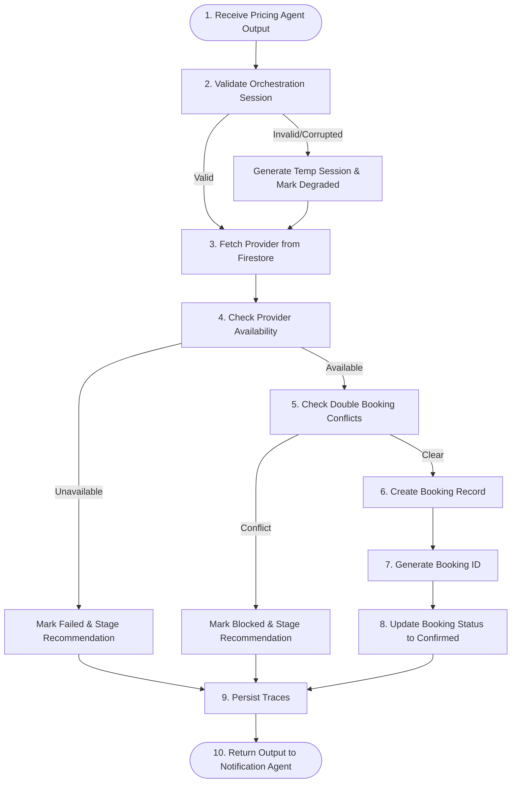

# BolDo Booking Agent Architecture & Logic Design

This document details the architectural specifications, state machines, validation strategies, conflict-handling rules, and error fallbacks for the **Booking Agent** within the BolDo multi-agent service orchestration pipeline.

---

## 1. System Overview & Context

In the BolDo ecosystem, the **Booking Agent** is responsible for taking the selected provider and pricing details and finalizing the booking. It performs strict validation, checks availability, prevents double bookings, simulates the provider's slot confirmation via the Gemini API, persists states across multiple Firestore collections, and packages the result for the downstream Notification Agent.

### Pipeline Context
```
Intent Agent ➔ Discovery Agent ➔ Ranking Agent ➔ Pricing Agent ➔ [Booking Agent] ➔ Notification Agent ➔ Follow-up Agent ➔ Dispute Agent
```

---

## 2. Core Responsibilities & Flow

The Booking Agent consists of a modular suite of services, models, and helper managers designed to satisfy the following 10-step booking flow:



---

## 3. Booking Lifecycle States

The Booking Agent governs the official transition of states within the `bookings` Firestore document:

* **`pending`**: Slot validation check cleared; simulated Gemini outreach initiated.
* **`confirmed`**: Simulated provider successfully accepted slot; record officially stored.
* **`provider_assigned`**: Provider officially locked and notified (transitioned during Notification Agent stage).
* **`in_progress`**: Work started by technician on-site.
* **`completed`**: Job resolved; receipt and rating finalized.
* **`cancelled`**: Session cancelled by user or provider prior to completion.
* **`failed`**: Cancelled or blocked due to unavailability, pricing conflicts, or timeouts.
* **`disputed`**: Job complete but locked in arbitration/complaint state (routes to Dispute Agent).

---

## 4. Strict Validation Strategies

The agent executes two validation layers: Input Schema Validation and Database State Validation.

### A. Input Validation Strategy (Pricing Output)
* **Check Pricing Presence:** Verifies `pricing_data` and `total_price_pkr` are present. If missing or corrupted:
  * *Threshold:* Clamps to basic tier price (500 PKR) if unrecoverable, flags `orchestration_status = "degraded"`, and logs an invalid pricing trace.
* **Orchestration Session Integrity:**
  * Checks if `session_id` exists in the `orchestration_sessions` collection.
  * Verifies `completed_agents` contains `"PricingAgent"`.
  * Checks that the previous status was not marked `failed`.
  * *If session is missing/corrupted:* Auto-generates a mock session ID (`temp_sess_[hash]`) to allow the transaction to complete, keeping the pipeline active.

### B. Provider Availability Verification
* Reads the provider record in the `providers` collection.
* Validates `is_available == true` and `status == "active"`.
* If validation fails, sets status to `failed` and triggers the **Alternative Recommendation** engine.

---

## 5. Conflict & Double Booking Logic (With Backup Recommendations)

### The Rule
If another user attempts to book the **same provider** for a slot that overlaps with an already confirmed booking (defined as +/- 2 hours of the requested `requested_time`):
1. **Reject Second Booking:** Transition the booking record to `failed` with reason `provider_double_booked`.
2. **Log Conflict Trace:** Write an entry in the `agent_traces` collection detailing the overlap.
3. **Generate Alternative Recommendation:** Query Firestore for backup providers of the *same* `service_type` that are currently marked `is_available == true`, and select the next highest-rated available provider.
4. **Maintain Continuity:** Return the alternative recommendation in the JSON response to the downstream Notification Agent.

---

## 6. Five Failure Scenarios & Fallback Handling Strategies

| Scenario | Impact | Mitigation & Recovery Strategy |
|---|---|---|
| **1. Provider Unavailable** | Slot cannot be locked in DB | Transition status to `failed` with code `provider_unavailable`. Query alternatives, package the backup provider in `alternative_recommendation`, and return an orchestration-safe payload to Notification Agent. |
| **2. Slot Already Booked** | Double booking conflict | Instantly reject the duplicate request. Write a `provider_double_booked` record in `agent_traces`, fetch alternative providers of same service type, and attach the alternative recommendation to maintain pipeline flow. |
| **3. Invalid Pricing Data** | Calculations may fail | If `total_price_pkr` is null or $\le 0$, default the price to a baseline basic tier price (500 PKR), mark `orchestration_status = "degraded"`, log trace of degraded computation, and proceed to complete booking confirmation. |
| **4. Firestore Write Failure** | State cannot be saved to cloud | Wrap Firestore writes in a try-catch. If a write fails, write the trace to a temporary local cache, return a successful simulated memory model to the Notification Agent with status `pending_confirmation`, enabling offline retry capability. |
| **5. Corrupted Orchestration Session** | Pipeline context lost | If the incoming session data is missing or corrupted, generate a temporary valid UUID for the session, initialize a new `orchestration_sessions` record, mark it as `degraded` and proceed with provider slot booking. |

---

## 7. JSON Input/Output Contracts

### Input Payload
```json
{
  "request_id": "req_abc123",
  "session_id": "sess_xyz789",
  "selected_provider": {
    "provider_id": "prov_456",
    "name": "Ali AC Repair",
    "service_type": "ac_technician"
  },
  "pricing_data": {
    "total_price_pkr": 1450.0,
    "confidence_score": 0.95,
    "breakdown": {
      "base_price": 1000.0,
      "distance_cost": 312.5,
      "urgency_multiplier": 1.3,
      "time_multiplier": 1.2,
      "loyalty_discount_value": 0.0
    }
  },
  "user_request": {
    "service_type": "ac_technician",
    "urgency": "same_day",
    "requested_time": "2026-05-19T23:00:00Z"
  },
  "booking_metadata": {
    "payment_method": "cash_on_delivery"
  }
}
```

### Output Payload (Success)
```json
{
  "request_id": "req_abc123",
  "session_id": "sess_xyz789",
  "agent_trace_id": "trace_book_1715800000_332",
  "orchestration_status": "success",
  "booking_id": "book_sess_xyz789",
  "booking_status": "confirmed",
  "selected_provider": {
    "provider_id": "prov_456",
    "name": "Ali AC Repair"
  },
  "pricing_data": {
    "total_price_pkr": 1450.0
  },
  "alternative_recommendation": null,
  "notification_payload": {
    "user": {
      "recipient_id": "user_customer_999",
      "channel": "sms",
      "template": "booking_confirmed",
      "message": "Assalam-o-Alaikum! Your booking for AC Technician (Ali AC Repair) has been CONFIRMED for 2026-05-19T23:00:00Z. Total amount: 1,450 PKR. Thank you for choosing BolDo!"
    },
    "provider": {
      "recipient_id": "prov_456",
      "channel": "sms",
      "template": "new_job_assigned",
      "message": "New job assigned! You have a booking for AC Technician on 2026-05-19T23:00:00Z. Total earning: 1,450 PKR. Please confirm availability in the app."
    }
  }
}
```

### Output Payload (Double-Booked/Unavailable Fallback)
```json
{
  "request_id": "req_abc123",
  "session_id": "sess_xyz789",
  "agent_trace_id": "trace_book_conflict_999",
  "orchestration_status": "failed",
  "booking_id": "book_sess_xyz789",
  "booking_status": "failed",
  "error_details": {
    "code": "provider_double_booked",
    "message": "The selected provider is already booked within 2 hours of your requested slot."
  },
  "alternative_recommendation": {
    "provider_id": "prov_789",
    "name": "Babar Electrician",
    "rating": 4.6,
    "service_type": "ac_technician",
    "reason": "Next best available AC Technician with rating 4.6"
  },
  "notification_payload": {
    "user": {
      "recipient_id": "user_customer_999",
      "channel": "sms",
      "template": "booking_failed_recommendation",
      "message": "Assalam-o-Alaikum! Ali AC Repair is currently busy at that hour. We recommend Babar Electrician (Rating: 4.6). Reply YES to confirm booking."
    }
  }
}
```
